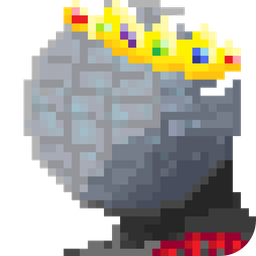
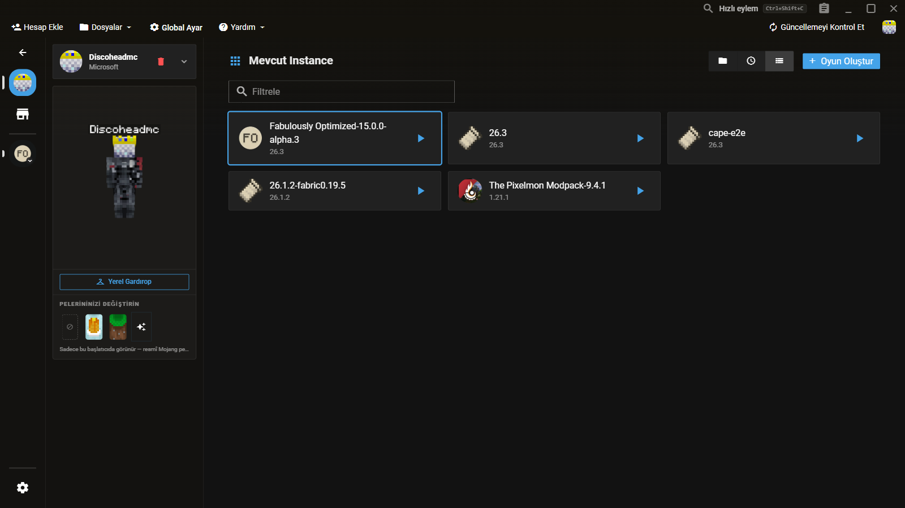
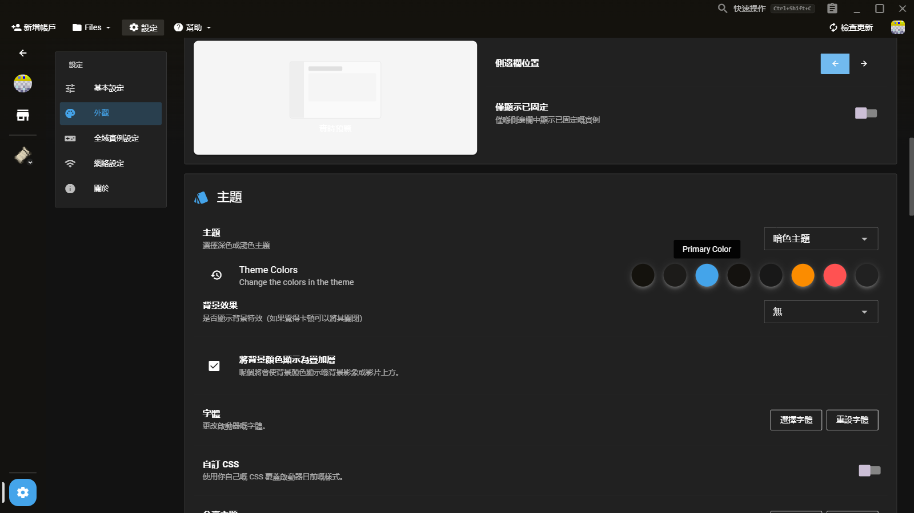

<p align="center">
  
</p>

<h1 align="center">Disco Launcher</h1>

<p align="center">
  <strong>A fast, lightweight, privacy-friendly Minecraft launcher — built for low-end machines.</strong><br>
  Hızlı, hafif ve gizlilik dostu bir Minecraft launcher'ı — <a href="README.md">Türkçe sürüm</a>
</p>

<p align="center">
  <a href="#-features">Features</a> ·
  <a href="#-screenshots">Screenshots</a> ·
  <a href="#-how-is-it-different-from-xmcl">Differences from XMCL</a> ·
  <a href="#-install">Install</a> ·
  <a href="#-development">Development</a> ·
  <a href="#-license">License</a>
</p>

<p align="center">
  
  
  
  
  
</p>

---

**Disco Launcher** is a fork of the open-source [X Minecraft Launcher (XMCL)](https://github.com/Voxelum/x-minecraft-launcher), rebuilt around a single idea: **keep what makes a launcher great, strip everything else**. On top of that cleanup it adds its own skin & cape management, a Prism-inspired flat UI, a dedicated color picker for the Launch button, and hardened networking defaults.

## ✨ Features

- 🪶 **Lightweight** — no telemetry, auto-update, P2P multiplayer or AI assistant
- 🔐 **Microsoft + offline accounts**
- 🧥 **Local skins & custom capes** — offline skins show up in game
- 🧩 **Modpack market** — CurseForge (own API key), Modrinth, FTB
- 🎨 **Prism-minimal theme** — 8 color pickers, incl. the Launch button color
- 🗂 **Multi-instance** · 💬 **Discord Rich Presence** · 🖥 **Windows / macOS / Linux**

## 📸 Screenshots

<p align="center">
  
</p>
<p align="center"><em>Home — instance grid with the full-height quick-actions panel on the right</em></p>

<p align="center">
  
</p>
<p align="center"><em>Appearance settings — 8 color pickers, including a dedicated color for the Launch button</em></p>

## 🆚 How Is It Different from XMCL?

| Area | XMCL | Disco Launcher |
| --- | --- | --- |
| Accounts | Microsoft, offline, ely.by, littleskin, XMCL.org | **Microsoft + offline only** |
| Multiplayer | XMCL Together P2P | **Removed** |
| Auto-update | Built-in updater | **Removed** — install a new setup bundle |
| Telemetry | Azure/OTel | **Removed** — nothing is collected |
| AI assistant | Built-in chat/analysis | **Removed** |
| News & Minecraft friends | Shipped in the sidebar | **Removed** |
| Skins | Skin library (Microsoft accounts) | **Kept and fixed** — opens for both account types |
| Capes | Official Mojang picker (Microsoft) | Official picker **+ launcher-local custom cape** |
| Offline skins in game | Not served by default | **Launcher-local yggdrasil endpoint** injects them |
| Modpack store | Discover grid + "Trending" carousel | Discover grid only; CF API key support, FTB list mode |
| Theme | Original XMCL look | **Prism-minimal restyle** + 8 color pickers + Launch button color |
| Branding | XMCL user agent, XMCL Discord app | `discolauncher/disco-launcher` UA, own Discord app, own installer |

Unchanged: the [@xmcl/*](packages) core library family, instance/resource linking architecture, CurseForge & Modrinth integrations, and the multi-instance model.

## 📦 Install

Grab the latest `DiscoLauncher-Setup-*.exe` (+ `.sha256`) from the [Releases](../../releases) page. Updates are installed the same way with a new bundle.

## 🛠 Development

**Prerequisites**

- [Node.js](https://nodejs.org/) **≥ 22.16** (Node 22 LTS recommended)
- [pnpm](https://pnpm.io/) 11 (Corepack picks it up automatically — `corepack enable`)

**Getting started**

```bash
# 1. Install dependencies (workspace-wide)
pnpm install --frozen-lockfile

# 2. Start the renderer dev server (http://localhost:3000)
pnpm dev:renderer

# 3. In a second terminal, compile & launch the Electron main process
pnpm dev:main
```

**Useful commands**

| Command | What it does |
| --- | --- |
| `pnpm check` | Type-checks every workspace package |
| `pnpm lint` | OxLint across all packages |
| `pnpm test` | Vitest unit suites |
| `pnpm build:renderer` | Production build of the Vue renderer |
| `pnpm dev:main` / `pnpm dev:renderer` | Dev runners for main process / renderer |
| `pnpm test:e2e:ci` | Deterministic, network-free Playwright e2e ([e2e](e2e)) |

> Conventions for agents and contributors: [AGENTS.md](AGENTS.md), [CONTRIBUTING.md](CONTRIBUTING.md)

**Building**

```bash
# Production renderer + main process bundle
pnpm build

# Full platform packaging through electron-builder
pnpm build:all
```

Targets live in [`xmcl-electron-app/build/electron-builder.config.ts`](xmcl-electron-app/build/electron-builder.config.ts): **Windows** NSIS (`DiscoLauncher-Setup-<version>.exe` + sha256), **macOS** dmg, **Linux** deb/rpm/AppImage/tar.xz/pacman.

## 📄 License

[MIT](LICENSE) — Disco Launcher inherits XMCL's MIT license. All credit for the original launcher goes to the [XMCL team](https://github.com/Voxelum/x-minecraft-launcher); localization and maintenance credits are listed in the [upstream acknowledgments](https://github.com/Voxelum/x-minecraft-launcher#credits--acknowledgments).
