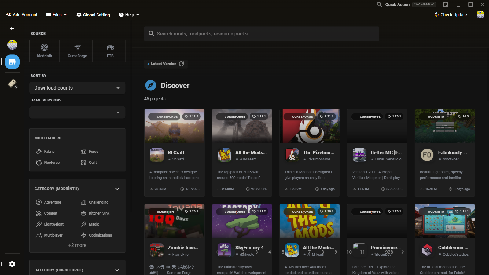

<p align="center">
  
</p>

<h1 align="center">Disco Launcher</h1>

<p align="center">
  <strong>Hızlı, hafif ve gizlilik dostu bir Minecraft launcher'ı — low-end makineler için tasarlandı.</strong><br>
  A fast, lightweight, privacy-friendly Minecraft launcher, built for low-end machines.
</p>

<p align="center">
  <a href="#-özellikler">Özellikler</a> ·
  <a href="#-ekran-görüntüleri">Ekran Görüntüleri</a> ·
  <a href="#-xmcl-farkı-nedir">XMCL Farkı</a> ·
  <a href="#-kurulum">Kurulum</a> ·
  <a href="#-geliştirme">Geliştirme</a> ·
  <a href="#-lisans">Lisans</a><br>
  <a href="README.en.md">🇬🇧 English version</a>
</p>

<p align="center">
  
  
  
  
  
</p>

---

**Disco Launcher**, açık kaynak [X Minecraft Launcher (XMCL)](https://github.com/Voxelum/x-minecraft-launcher) projesinin bir fork'u; tek bir fikir etrafında yeniden inşa edildi: **bir launcher'ı iyi yapan şeyi koru, geri kalanını çıkar.** Bu sadeleştirmenin üzerine kendi kaplama & pelerin yönetimi, Prism'den ilham alan düz arayüz, "Başlat" butonuna özel renk seçici ve sağlamlaştırılmış ağ varsayılanları eklendi.

## ✨ Özellikler

- 🪶 **Hafif** — telemetri, oto-güncelleme, P2P çok oyunculu ve AI asistanı yok
- 🔐 **Microsoft + çevrimdışı hesaplar**
- 🧥 **Yerel kaplamalar & özel pelerin** — çevrimdışı kaplamalar oyunda görünür
- 🧩 **Mod paketi mağazası** — CurseForge (kendi API anahtarınla), Modrinth, FTB
- 🎨 **Prism-minimal tema** — 8 renk seçici; "Başlat" butonu rengi dahil
- 🗂 **Çoklu instance** · 💬 **Discord Rich Presence** · 🖥 **Windows / macOS / Linux**

## 📸 Ekran Görüntüleri

<p align="center">
  
</p>
<p align="center"><em>Ana ekran — instance ızgarası, sağda tam yükseklikli hızlı eylem paneli</em></p>

<p align="center">
  
</p>
<p align="center"><em>Görünüm ayarları — 8 renk seçicisi ve "Başlat" butonu için özel renk</em></p>

<p align="center">
  
</p>
<p align="center"><em>Mod paketi mağazası — CurseForge, Modrinth ve FTB; keşif ızgarası</em></p>

## 🆚 XMCL Farkı Nedir?

Disco Launcher, XMCL'nin optimizasyon fork'u olarak başladı. Bilinçli farkların özeti:

| Alan | XMCL | Disco Launcher |
| --- | --- | --- |
| Hesaplar | Microsoft, çevrimdışı, ely.by, littleskin, XMCL.org | **Sadece Microsoft + çevrimdışı** |
| Çok oyunculu | XMCL Together P2P | **Kaldırıldı** |
| Otomatik güncelleme | Yerleşik updater | **Kaldırıldı** — yeni setup paketi kur |
| Telemetri | Azure/OTel | **Kaldırıldı** — hiçbir şey toplanmaz |
| AI asistan | Yerleşik sohbet/analiz | **Kaldırıldı** |
| Haberler & Minecraft arkadaşları | Kenar çubuğunda | **Kaldırıldı** |
| Kaplamalar | Skin library (sadece MS hesabı) | **Korundu ve düzeltildi** — iki hesap türünde de açılır |
| Pelerinler | Resmi Mojang seçici (MS) | Resmi seçici **+ launcher-yerel custom cape** |
| Çevrimdışı kaplama oyunda | Varsayılan yok | **Yerel yggdrasil ucu** enjekte eder |
| Mod paketi mağazası | Keşif + "Trending" karuseli | Sadece keşif ızgarası; CF API anahtarı, FTB liste modu |
| Tema | Orijinal XMCL görünümü | **Prism-minimal restyle** + 8 renk seçici + Başlat butonu rengi |
| Marka | XMCL user agent, XMCL Discord app | `discolauncher/disco-launcher` UA, kendi Discord uygulaması, kendi installer'ı |

Değişmeyen: [@xmcl/*](packages) çekirdek kütüphane ailesi, instance/resource bağlama mimarisi, CurseForge & Modrinth entegrasyonları ve çoklu instance modeli.

## 📦 Kurulum

En son `DiscoLauncher-Setup-*.exe` (+.sha256) paketini [Releases](../../releases) sayfasından indir ve kur. Güncellemeler de aynı şekilde yeni paketle yapılır.

## 🛠 Geliştirme

**Gereksinimler**

- [Node.js](https://nodejs.org/) **≥ 22.16** (Node 22 LTS önerilir)
- [pnpm](https://pnpm.io/) 11 (Corepack otomatik alır — `corepack enable`)

**Başlangıç**

```bash
# 1. Bağımlılıkları kur (workspace geneli)
pnpm install --frozen-lockfile

# 2. Renderer dev sunucusunu başlat (http://localhost:3000)
pnpm dev:renderer

# 3. İkinci terminalde Electron ana sürecini derle & başlat
pnpm dev:main
```

**Sık kullanılan komutlar**

| Komut | İşlev |
| --- | --- |
| `pnpm check` | Tüm workspace paketlerini tip kontrolünden geçirir |
| `pnpm lint` | Tüm paketlerde OxLint |
| `pnpm test` | Vitest unit testleri |
| `pnpm build:renderer` | Vue renderer üretim derlemesi |
| `pnpm dev:main` / `pnpm dev:renderer` | Ana süreç / renderer dev çalıştırıcıları |
| `pnpm test:e2e:ci` | Ağsız, deterministik Playwright e2e ([e2e](e2e)) |

> Katkı ve agent kuralları: [AGENTS.md](AGENTS.md), [CONTRIBUTING.md](CONTRIBUTING.md)

**Derleme**

```bash
# Renderer + ana süreç üretim derlemesi
pnpm build

# electron-builder ile tam paketleme
pnpm build:all
```

Hedefler [`xmcl-electron-app/build/electron-builder.config.ts`](xmcl-electron-app/build/electron-builder.config.ts) içinde tanımlı: **Windows** NSIS (`DiscoLauncher-Setup-<sürüm>.exe` + sha256), **macOS** dmg, **Linux** deb/rpm/AppImage/tar.xz/pacman.

## 📄 Lisans

[MIT](LICENSE) — Disco Launcher, XMCL'nin MIT lisansını devralır. Orijinal launcher için tüm katkı [XMCL ekibine](https://github.com/Voxelum/x-minecraft-launcher) aittir; yerelleştirme ve bakım emeği için upstream [teşekkürler bölümüne](https://github.com/Voxelum/x-minecraft-launcher#credits--acknowledgments) bakabilirsin.
